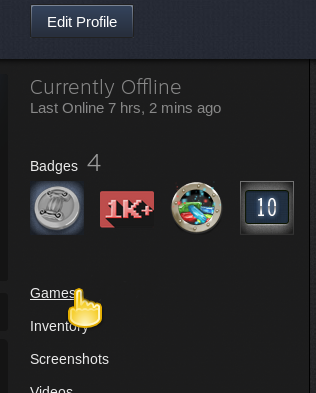
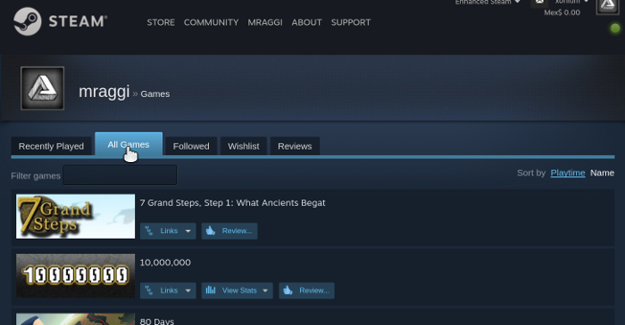

# Description
A short python script to scrape all games with a given rating from AppDB at winehq.org and compare them to your list of games from steam. 

You are free to use these scripts however you see fit.

However, if you do use them, consider donating to the good guys over at https://www.winehq.org for all their great work (at https://www.winehq.org/donate).

# Usage
First, make sure you have python3 and Beautiful Soup and lxml installed. They probably already come with your python3 
installation. If not, type in something like `sudo pacman -S python3-lxml python3-beautifulsoup4` (or the corresponding thing 
with apt-get).

We provide two tools and a third one that uses both to compare results: 
1. `winehqextract.py` downloads and prints games with different ratings.
2. `steamextract.py` extracts game information from an already downloaded website from steampowered.com
3. `winesteamcompare.py` uses both of the above to generate a list of the games you own on steam that can be played using wine (either gold or platinum rating).

All three tools are easy to modify or extend to suit your needs.

## If you want to know which of your steam games can be played using wine
The first thing you have to do after downloading the .py files from github is to open your browser and login to http://steampowered.com/ using your username and password. This is because unfortunately I don't (yet) know how to log-in automatically, since steam uses some weird authentication with phones and whatnot. So maybe in the future this step will be skipped, but for now the solution is to download the page yourself.

Log-in to steam through your browser, then go to [Your User Name] -> Games -> All Games, like in the following images.




You should see all your games in there. 

Now save the page (CTRL-S) with the file name `MySteamGames.html` in the same folder you downloaded the python scripts This file name is important, since it's the file name winesteamcompare expects.

Now, just run

```bash
	python3 winesteamcompare.py
```

and voilà, after a while you'll get a list of games and their respective ratings. Let me know if you find an error, like a game that is in your steam games and is marked either platinum or gold in the appDB but isn't showing.

## If you just want to use the wine extractor
Just download winehqextract.py an run the python script with options [-pgsbx] to get a list of Platinum, Gold, Silver, Bronze and Garbage, either with `python3 winehqextract.py -h` or `chmod +x winehqextract.py` and then `./winehqextract.py --help`. 

These commands will print a list of options. The options are straightforward: `-p` or `--platinum` for all platinum games, `-g` or `--gold` for all gold games, etc.

For example, the following command finds all games with a rating of platinum or gold and prints them out.

```bash
	./winehqextract.py -pg
```

Bear in mind that the command may take a while, since it has to download all pages from the appDB, 

## If you just want a list of all your steam games

Finally, if you only need a list of your steam games printed to the console (for some reason), do the following:

The first thing you have to do is open your browser and login to http://steampowered.com/ using your username and password. This is because unfortunately I don't (yet) know how to log-in automatically, since steam uses some weird authentication with phones and whatnot. So maybe in the future this step will be skipped, but for now the solution is to download the page yourself.

Log-in to steam through your browser, then go to [Your User Name] -> Games -> All Games. You should see all your games in there. Now save the page in the same directory as the scripts. Suppose you named it `banana.html`

Now, just run

```bash
	python3 steamextract.py banana.html
```

# Future plans

* Support your wishlist too, not only games you own.
* Find a way to filter games that already have a native linux client.
* Making a firefox/chromium extension that tells you the wine AppDB ratings of any game you look at. Help in this area would be greatly appreciated.
* Some exception handling. Right now if something goes wrong, you just see the traceback instead of a useful message advising on what went wrong.

# Acknowledgements
This scripts were written in an afternoon by Miguel Raggi (mraggi@gmail.com) in order to learn some web scraping. They might contain bugs, assume things you can't, and so on. Please report any problems you find. The real work was done by the people at winehq.org, who mantain the appDB.
